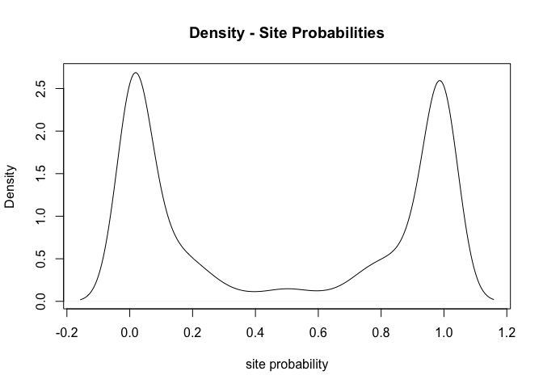
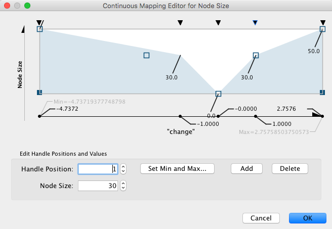

# Introduction/overview of workshop

This workshop will demonstrate inference of kinase activity from phospho-proteomics data using ```KinSwingR``` (and ```phosphoProcessR``` for processing of phosphoproteomics data).

**Overview of workshop**

+ Run through pre-requisites
+ Introduction to example data
+ Processing of phosphoproteomics data (very quick QC)
+ Inferring kinase activity
+ Visualizing networks
+ If we don't finished? Optional homework :/

# Pre-requisites

The following will need to be installed prior to starting:

+ **```R/RStudio```** Preferable to have R Studio installed in addition to R. 
See here: https://www.rstudio.com/products/rstudio/download/

+ **```devtools```** required for installation of packages from github. 
Go here and follow instructions: https://cran.r-project.org/web/packages/devtools/readme/README.html

+ **```KinSwingR```** Package for Kinase activity prediction.
Go here and follow installation instructions: https://bioconductor.org/packages/release/bioc/html/KinSwingR.html

+ **```phosphoProcessR```** package for analysis of phospho-proteomics data (and example data). See here: https://github.com/awaardenberg/phosphoProcessR

+ **```cytoscape```** for visualization of networks. 
Go here and download: https://cytoscape.org/

Prior to this workshop you should have everything installed, except ```phosphoProcessR```. Install now following the instructions above (or see Appendix for more details).

Once all the pre-requisites are installed, you will be ready to follow the workshop.

# Brief background to phosphoproteomics

Phospho-proteomics is concerned with the identification of the phosphorylated component of the proteome. Phosphorylation is the largest proportion of post-translational modifications (PTMs) and is associated with the increased as well as decreased activity of proteins. This is primarily under the control of protein kinase and protein phosphatases, which add or remove phosphate groups to proteins in an ATP dependent manner.

Image here of kinase/phosphatase relationship.

There are a number of methods to identify phosphorylated proteins. Generally these methods start either begin with labeling/non-labelled samples followed by specific enrichment of the phospho-peptide fraction followed by quantification. For a TMT experiment (these come in a numbers flavors), samples are labelled with a number of mass tags, separated by 1 Dalton, which are then deconvoluted by mass-spectrometry. Today we will be utilizing public data using the TMT-10plex tagging method, which allows mixtures of up to 10 samples with different mass tags.

A typical phosphoproteomics workflow (pilfered from @Kozlov2015)

<!-- -->

# Example data

## Host malaria infection phospho-proteomics

The example data that we will be using is attached to the ```phosphoProcessR``` R package that you will have now downloaded and installed from github.

These example data relate to a data set containing post-translational modifications derived from *Plasmodium falciparum*-infected (past infected) and non-infected human placenta's. See original publication for more details: Kawahara et al. MCP 2018 https://doi.org/10.1074/mcp.RA118.000907

Samples consist of:
+ 5x human non-infected control placenta samples
+ 5x human malaria infected placenta samples 

Data is available on Proteome Exchange (link in Appendix).

## Data summary

The data that we will use for this workshop is already embedded in the ```phosphoProcessR``` R package. These files are summarized below. *You can try downloading these files from the repository yourself and importing to phosphoProcessR - see Appendix for more details*

### Evidence.txt file

+ **```malaria_evidence_example```** *MaxQuant - evidence.txt file format* This file contains data derived from conversion of  mass-spectrometry signal to phospho-peptides [14,687 rows and 103 columns]. Data has  been processed with MaxQuant, to convert  mass-spectrometry signals into quantitative signals and identify phosphosites. Peptide sequences have been mapped to the human proteome. 

*MaxQuant is a popular software used in proteomics. MaxQuant has it's own summer schools etc. (thus, well and truly beyond the scolpe of this workshop!). For more information: https://maxquant.org/ *

**```malaria_evidence_example```** details of where to find this file are in the Appendix to this workshop.

Although there are 103 columns, the important columns that we will be interested in today are summarized below:


Table: malaria_evidence_example

Phospho..STY..Probabilities                      Leading.proteins    Reporter.intensity.corrected.0
-----------------------------------------------  -----------------  -------------------------------
AAAAGLGHPAS(0.14)PGGS(0.86)EDGPPGSEEEDAAR        Q99856                                         0.0
AAAAGLGHPAS(0.995)PGGS(0.005)EDGPPGSEEEDAAR      Q99856                                      4167.7
AAAAGLGHPAS(0.976)PGGS(0.024)EDGPPGS(1)EEEDAAR   Q99856                                      5087.4
AAAAGLGHPAS(0.217)PGGS(0.783)EDGPPGS(1)EEEDAAR   Q99856                                      6633.1
AAAAGLGHPAS(1)PGGS(0.997)EDGPPGS(0.003)EEEDAAR   Q99856                                         0.0

These columns correspond to:


Table: 

Column                           Meaning                                                   
-------------------------------  ----------------------------------------------------------
Leading.proteins                 Annotation of Proteins                                    
Phospho..STY..Probabilities      Peptide sequence, location of phosphosite and probability 
Reporter.intensity.corrected.0   Intensity for first label                                 
Reporter.intensity.corrected.1   Intensity for second label, so forth                      

### Reference Proteome

+ **```human_fasta_example```** *Reference Proteome - Fasta format* This reference proteome is in FASTA format and contains all amino acid sequences that make up the protein complement of the human genome. This fasta file was used for the peptide mapping by MaxQuant (this is important for ```phosphoProcessR```). 

The fasta file can be downloaded from the pride database and loaded into R using ```seqinr``` as per the Appendix.

### Annotation table describing experimental design

+ **```malaria_annotation_example```** *Annotation file* that contains details of the experimental design. It contains 3 columns that must be named "samples", "labels" and "group" for compatibility with the current version of ```phosphoProcessR```. This table is used to 1) extract the relevant columns from the evidence file and 2) determine groups for statistical analysis.

Summary of table:


Table: malaria_annotation_example

samples                          labels      group   
-------------------------------  ----------  --------
Reporter.intensity.corrected.0   infect_1    infect  
Reporter.intensity.corrected.1   infect_2    infect  
Reporter.intensity.corrected.2   infect_3    infect  
Reporter.intensity.corrected.3   infect_4    infect  
Reporter.intensity.corrected.4   infect_5    infect  
Reporter.intensity.corrected.5   control_1   control 

# phosphoProcessR

Now we will begin the *hands-on* part of the workshop!

## Introduction to phosphoProcessR

```phosphoProcessR``` provides core utilities for performing Differential Phosphorylation Analysis (DPA). It has functionality for remapping and annotating *evidence.txt* files produced by MaxQuant, ready for further statistical analysis.

Key functionality of ```phosphoProcessR``` includes normalization, missing value imputation, batch correction (utilizing Surrogate Variable Analysis: ```sva```) and statistical analysis of differential phosphorylation using ```limma```. ```phosphoProcessR``` **in development**, but effectively implements an updated workflow that was originally used in @Kozlov2015 and described in @Waardenberg2017 as well as @Kasper2018.

phosphoProcessR contains 3 core functions:

+ **```tidyEvidence```** remap and merge MaxQuant evidence.txt file into "tidy" data.frame
+ **```phosphoDE```** perform Differential Phosphorylation Analysis (DPA)
+ **```plot_this```** wrappers of various plotting functions

Detailed information for each of these functions and default parameters can be accessed using the ```?``` command before the function of interest. E.g. ```?tidyEvidence``` will display the following:

<!-- -->

## phosphoProcessR-ing Placental Malaria

We will now use phosphoProcessR to perform DPA on the phospho-peptides identified by Kawahara et al. MCP 2018 and use this as input to ```KinSwingR``` for **kinase activity prediction**.

Begin by loading ```phosphoProcessR``` in ```R``` and the data libraries included in the package (*as outlined above*).


```r
# load phosphoProcessR
library(phosphoProcessR)
# load example proteome in fasta format
data(human_fasta_example)
# load example evidence.txt
data(malaria_evidence_example)
# load example annotation file
data(malaria_annotation_example)
```

Next we will call ```tidyEvidence``` which will reformat and remap the evidence file for use with ```phosphoDE```. The following parameters are set:

+ ```window_size = 15```; this is the width of the centered sequence to obtain
+ ```min_prob = 0.7```; minimum probability observed to keep a phosphosite
+ ```filter_site_method = "site"```; this will only keep sites in a peptide that pass ```min_prob```


```r
# tidyEvidence supports multi-core processing using the BiocParallel 

# load BiocParallel library
library(BiocParallel)

# set/register the number of cores to use
# here 4 cores are used for processing
register(SnowParam(workers = 4))

# call tidyEvidence
evidence_tidy <- tidyEvidence(evidence_file = malaria_evidence_example,
                              annotation_file = malaria_annotation_example,
                              fasta_file = human_fasta_example,
                              window_size = 15,
                              min_prob = 0.7,
                              filter_site_method = "site")

# view the reformatted data
head(evidence_tidy$intensity, 5)
##                                                     infect_1 infect_2
## ARID3A|Q99856|77;88|AGLGHPASPGGSEDG;SEDGPPGSEEEDAAR 12.31271 12.37640
## ARID3A|Q99856|77|AGLGHPASPGGSEDG                    12.02504 11.97935
## ARID3A|Q99856|81;88|HPASPGGSEDGPPGS;SEDGPPGSEEEDAAR 12.12854 11.90264
## SEPT11|Q9NVA2|417|QQSGAQQTKKDKDKK                   12.95632 13.61218
## PCYT1A|P49585|362|KAAAYDISEDEEDXX                   11.46643 11.44507
##                                                     infect_3 infect_4
## ARID3A|Q99856|77;88|AGLGHPASPGGSEDG;SEDGPPGSEEEDAAR 12.46646 12.58360
## ARID3A|Q99856|77|AGLGHPASPGGSEDG                    11.90358 11.22960
## ARID3A|Q99856|81;88|HPASPGGSEDGPPGS;SEDGPPGSEEEDAAR 12.06864 11.66548
## SEPT11|Q9NVA2|417|QQSGAQQTKKDKDKK                   13.15003 12.07908
## PCYT1A|P49585|362|KAAAYDISEDEEDXX                   11.35656 10.94661
##                                                     infect_5 control_1
## ARID3A|Q99856|77;88|AGLGHPASPGGSEDG;SEDGPPGSEEEDAAR 12.57757  12.10365
## ARID3A|Q99856|77|AGLGHPASPGGSEDG                    11.92270  11.16176
## ARID3A|Q99856|81;88|HPASPGGSEDGPPGS;SEDGPPGSEEEDAAR 12.07647  11.67864
## SEPT11|Q9NVA2|417|QQSGAQQTKKDKDKK                   12.54451  12.26086
## PCYT1A|P49585|362|KAAAYDISEDEEDXX                   10.95412  10.89019
##                                                     control_2 control_3
## ARID3A|Q99856|77;88|AGLGHPASPGGSEDG;SEDGPPGSEEEDAAR  12.45830  12.76458
## ARID3A|Q99856|77|AGLGHPASPGGSEDG                     12.41500  12.34516
## ARID3A|Q99856|81;88|HPASPGGSEDGPPGS;SEDGPPGSEEEDAAR  12.23811  12.17076
## SEPT11|Q9NVA2|417|QQSGAQQTKKDKDKK                    12.23787  12.52875
## PCYT1A|P49585|362|KAAAYDISEDEEDXX                    11.18704  11.43186
##                                                     control_4 control_5
## ARID3A|Q99856|77;88|AGLGHPASPGGSEDG;SEDGPPGSEEEDAAR  12.64654  12.33787
## ARID3A|Q99856|77|AGLGHPASPGGSEDG                     12.12725  12.01601
## ARID3A|Q99856|81;88|HPASPGGSEDGPPGS;SEDGPPGSEEEDAAR  12.30269  12.22575
## SEPT11|Q9NVA2|417|QQSGAQQTKKDKDKK                    12.97741  12.30600
## PCYT1A|P49585|362|KAAAYDISEDEEDXX                    11.54738  11.15279
```

**Better?**

### Plot Phosphorylation Site Probability distribution

```tidyEvidence``` was called with ```min_prob = 0.7```, being the minimum probability observed to keep a phosphosite. ***What this a good threshold?*** Let's have a look.

The outputs of ```tidyEvidence``` include a vector of of all phosphosite probabilities observed. We can now used this to inform on the ```min_prob``` threshold utilized in ```tidyEvidence```. 

To visualize we use one of the ```plot_this``` wrappers, as follows:


```r
plot_this(data_in = evidence_tidy$site_probability,
          title = "Site Probabilities",
          density = TRUE)
```

<!-- -->

**Question:** what do you conclude about the probability distribution and the threshold used?

## Differential Phosphorylation Analysis (DPA)

Having obtained a table of the phosphorylation sites and their values (in a tidy data.frame using ) using ```tidyEvidence``` we can test for differential phosphorylation using ```phosphoDE```. ```phosphoDE``` uses ```limma``` for final statistical analysis in combination with a workflow previously described in @Waardenberg2017.

We will correct data, but not perform multiple-hypothesis correction. You can play with this... The original paper described a lack of large differences between the two groups as potential individual variability. We are interested in this data set as an example for the moment...


```r
# utilising intensity values derived from tidyEvidence, we now perform DPA.
# DPA is currently limited to pairs of groups defined in an annotation_file.

DPA_out <- phosphoDE(phospho_input = evidence_tidy$intensity,
                     annotation_file = malaria_annotation_example,
                     correct = TRUE,
                     adjust_method = "none")
## Number of significant surrogate variables is:  2 
## Iteration (out of 5 ):1  2  3  4  5

head(DPA_out$results, 4)
##                                                             logFC
## OTUD4|Q01804|1024|QRPKEESSEDENEVS                      -0.7476597
## TNKS1BP1|Q9C0C2|221|STLFRGWSQEGPVKS                     0.7876153
## NUFIP2|Q7Z417|629|ESQNPLASPTNTLLG                       0.8196903
## SRRM2|Q9UQ35|1972;1974|VTRRRSRSRTSPITR;RRRSRSRTSPITRRR -0.7140013
##                                                          AveExpr         t
## OTUD4|Q01804|1024|QRPKEESSEDENEVS                      10.015042 -6.041931
## TNKS1BP1|Q9C0C2|221|STLFRGWSQEGPVKS                    11.559190  4.803736
## NUFIP2|Q7Z417|629|ESQNPLASPTNTLLG                       8.269123  4.722778
## SRRM2|Q9UQ35|1972;1974|VTRRRSRSRTSPITR;RRRSRSRTSPITRRR  7.834709 -4.457842
##                                                             P.Value
## OTUD4|Q01804|1024|QRPKEESSEDENEVS                      6.517681e-05
## TNKS1BP1|Q9C0C2|221|STLFRGWSQEGPVKS                    4.639233e-04
## NUFIP2|Q7Z417|629|ESQNPLASPTNTLLG                      5.313877e-04
## SRRM2|Q9UQ35|1972;1974|VTRRRSRSRTSPITR;RRRSRSRTSPITRRR 8.337419e-04
##                                                        adj.P.Val
## OTUD4|Q01804|1024|QRPKEESSEDENEVS                      0.1283983
## TNKS1BP1|Q9C0C2|221|STLFRGWSQEGPVKS                    0.2516499
## NUFIP2|Q7Z417|629|ESQNPLASPTNTLLG                      0.2516499
## SRRM2|Q9UQ35|1972;1974|VTRRRSRSRTSPITR;RRRSRSRTSPITRRR 0.2516499
##                                                                 B
## OTUD4|Q01804|1024|QRPKEESSEDENEVS                       1.3841464
## TNKS1BP1|Q9C0C2|221|STLFRGWSQEGPVKS                    -0.0479490
## NUFIP2|Q7Z417|629|ESQNPLASPTNTLLG                      -0.1514811
## SRRM2|Q9UQ35|1972;1974|VTRRRSRSRTSPITR;RRRSRSRTSPITRRR -0.4985424
```

## Some quick QC - what is going on?

### Principle Component Analysis


```r
plot_this(data_in = DPA_out$corrected_data,
          annotation_file = malaria_annotation_example,
          legend = TRUE,
          label = TRUE,
          title = "Malaria infected vs. non-infected Placenta",
          pca = TRUE)
```

<!-- -->

### Hierarchicical clustering


```r
plot_this(data_in = DPA_out$corrected_data,
          annotation_file = malaria_annotation_example,
          legend = TRUE,
          label = TRUE,
          title = "Malaria infected vs. non-infected Placenta",
          hclust = TRUE)
```

<!-- -->

Well... discussion?

# KinSwingR

## Introduction (extract from KinSwingR vignette)

```KinSwingR``` aims to predict kinase activity from phoshoproteomics data. It implements the alogorithm described in: @Kasper2018 and @Waardenberg2018. ```KinSwingR``` predicts kinase activity by integrating kinase-substrate predictions and the fold change and signficance of change for peptide sequences obtained from phospho-proteomics studies. The score is based on the network connectivity of kinase-substrate networks and is weighted for the number of substrates as well as the size of the local network. P-values are provided to assess the significance of the KinSwing scores, which are determined through random permutations of the kinase-substrate network.

```KinSwingR``` implements 3 core functions:

+ **```buildPWM```** builds position weight matrices (PWMs) from known kinase-substrate sequences
+ **```scoreSequences```** score PWMs build using ```buildPWM``` against input phosphoproteome data
+ **```swing```** integrates PWM scores, direction of phosphopeptide change and significance of phosphopeptide change into a *swing* score.

The KinSwing score is a metric of kinase activity, ranging from positive to negative, and p-values are provided to determine significance.

Additional functions include

+ **```cleanAnnotation```** function to tidy annotations and extract peptide sequences.
+ **```viewPWM```** function to view PWM models

We will use all of these functions today.

## Extracting peptides with ```cleanAnnotation```

Having obtained differential phosphorylation data, we will now move onto analyzing the data with KinSwingR - beginning with extracting peptide sequences from the annotation column.


```r
# load the KinSwingR R package
library(KinSwingR)

# phosphoProcessR already provides the output in a format ready for KinSwingR
kinswing_input <- DPA_out$kinswingr_input

# view the data
head(kinswing_input, 3)
##                            annotation peptide         fc         pval
## 1   OTUD4|Q01804|1024|QRPKEESSEDENEVS      NA -0.7476597 6.517681e-05
## 2 TNKS1BP1|Q9C0C2|221|STLFRGWSQEGPVKS      NA  0.7876153 4.639233e-04
## 3   NUFIP2|Q7Z417|629|ESQNPLASPTNTLLG      NA  0.8196903 5.313877e-04

# You will notice the peptide column is currently empty.
# cleanAnnotation provides the ability to...
# based on...

annotated_data <- cleanAnnotation(input_data = kinswing_input,
                                  annotation_delimiter = "|",
                                  multi_protein_delimiter = ":",
                                  multi_site_delimiter = ";",
                                  seq_number = 4,
                                  replace = TRUE,
                                  replace_search = "X",
                                  replace_with = "_")

# view the data. The peptide sequences should now be extracted from the annotation column
head(annotated_data, 3)
##                            annotation         peptide         fc
## 1   OTUD4|Q01804|1024|QRPKEESSEDENEVS QRPKEESSEDENEVS -0.7476597
## 2 TNKS1BP1|Q9C0C2|221|STLFRGWSQEGPVKS STLFRGWSQEGPVKS  0.7876153
## 3   NUFIP2|Q7Z417|629|ESQNPLASPTNTLLG ESQNPLASPTNTLLG  0.8196903
##           pval
## 1 6.517681e-05
## 2 4.639233e-04
## 3 5.313877e-04
```

## Build Position Weight Matrices (PWM)

These are obtained from... How to get and format...

The first step to inferring kinase activity, is to build Position Weight Matrices (PWMs) for kinases. This can be done using ```buildPWM``` for any table containing centered substrate peptide sequences for a list of kinases. The data we will use ```data(phosphositeplus_human)``` has been extracted from the phosphositeplus website and contains annotated and centered substrate sequences for kinases. This can be obtained from: https://www.phosphosite.org/


```r
# quick peak at the data for building the PWM models
head(phosphositeplus_human, 5)
##      kinase    substrate        
## [1,] "EIF2AK1" "MILLSELSRRRIRSI"
## [2,] "EIF2AK1" "RILLSELSR______"
## [3,] "EIF2AK1" "IEGMILLSELSRRRI"
## [4,] "PRKCD"   "MKKKDEGSYDLGKKP"
## [5,] "PRKCD"   "FPLRKTASEPNLKVR"

# build the PWM models
pwms <- buildPWM(phosphositeplus_human, substrates_n = 10)
```

### view a PWM

```KinSwingR``` also includes functionality for visualizing motifs.

Save this to an object. Why?

To view the motif ensure you set ```view_pwm``` to ```TRUE```!


```r
NEK_pwm <- viewPWM(pwm_in = pwms, 
                   which_pwm = "CAMK2A", 
                   view_pwm = TRUE)
```

<!-- -->

## Score PWM-substrate matches


```r
library(BiocParallel)
# finally set/register the number of cores to use
register(SnowParam(workers = 4))
# set seed for reproducible results
set.seed(1234)
scores <- scoreSequences(input_data = annotated_data,
                         pwm_in = pwms,
                         n = 1000)
```

All data is accessible from scores. We won't look into this today, but just for future reference:

The outputs of ```scores``` are transparent and accessible. These are however primarily intermediate tables for obtaining swing scores. ```scores``` is a simple list object that contains peptide scores ```(scores$peptide_scores)```, p-values for the peptide scores ```(scores$peptide_p)``` and the background peptides used to score significance ```(scores$background)``` for reproducibility (i.e. the background can saved and reused for reproducibility).

## Calculate KinSwing scores

Having built a kinase-substrate network (we will look at this later), ```swing``` integrates the kinase-substrate predictions, directionality and significance of phosphopeptide fold change to assess local connectivity (or swing) of kinase-substrate networks. 

The final score is a normalised score of predicted kinase activity that is weighted for the number of substrates used in the PWM model and number of peptides in the local kinase-substrate network. 

We will set the following parameters:
+ ```p_cut_fc = 0.10``` to include substrates with DPA less than this p-value
+ ```return_network = TRUE``` to return an interaction network that will visualise later
+ ```permutations = 1000``` to permute the network 1000 times to assess the change of finding a swing score. 


```r
register(SnowParam(workers = 4))
# set seed for reproducible results
set.seed(1234)
swing_out <- swing(input_data = annotated_data,
                   pwm_in = pwms,
                   pwm_scores = scores,
                   p_cut_fc = 0.10,
                   return_network = TRUE,
                   permutations = 1000)

head(swing_out$scores)
##     kinase pos neg all        pk        nk swing_raw  n    swing
## 99    NEK6  20   4  24 0.8333333 0.1666667  39.39471 13 1.901356
## 102  NTRK2  29   9  38 0.7631579 0.2368421  30.64640 11 1.372837
## 101  NTRK1  24   7  31 0.7741935 0.2258065  33.52992 14 1.547041
## 126  PRKD1  19   5  24 0.7916667 0.2083333  53.56742 67 2.757585
## 63   IRAK1  20   6  26 0.7692308 0.2307692  31.08516 14 1.399344
## 38   DAPK1  23   7  30 0.7666667 0.2333333  31.16229 13 1.404004
##       p_greater   p_less
## 99  0.000999001 0.990010
## 102 0.004995005 0.989011
## 101 0.018981019 0.978022
## 126 0.019980020 0.973027
## 63  0.032967033 0.961039
## 38  0.033966034 0.956044
```

### Visualise Motifs

View the top motifs from swing using ```viewPWM```. Refer back to previous example.

# Network Visualisation

Having obtained information of the phosphopeptides, the kinases inferred to be acting on them. Let's go about trying to visualize this information as networks.

We will use cytoscape for now - ***R*** later?

## Extracting networks

Recall above when calling ```swing``` we set the ```return_network``` parameter to ```TRUE```. This allows for the interaction network between all kinases and substrate sequences to be obtained. This contains all the kinase-substrate interactions used in ```swing``` to assess local kinase networks.

We will first look at the total network and then extract a more defined local networks.

### Total kinase-substrate interaction network


```r
# extract the total network from the swing output 
total_network <- swing_out$network
head(total_network)
##   source
## 1  PRKCD
## 2  PRKCD
## 3  PRKCD
## 4  PRKCD
## 5  PRKCD
## 6  PRKCD
##                                                                 target
## 1                    ACIN1|Q9UKV3|595|SSRSRSRSPDSSGSR::SSRSRSRSPDSSGSR
## 2                    ACIN1|Q9UKV3|710|SVQARRLSQPESAEK::SVQARRLSQPESAEK
## 3                     ACLY|P53396|455|PAPSRTASFSESRAD::PAPSRTASFSESRAD
## 4 ADD3|Q9UEY8|677;681|EVLSPEGSPSKSPSK;PEGSPSKSPSKKKKK::PEGSPSKSPSKKKKK
## 5                     ADD3|Q9UEY8|681|PEGSPSKSPSKKKKK::PEGSPSKSPSKKKKK
## 6                    ARGLU1|Q9NWB6|94|RTVSKRSSLDEKQKR::RTVSKRSSLDEKQKR
```

What about the "::"? This is used to identify which target peptide was tested and the kinase-substrate matching was less than ```p_cut_pwm``` in ```swing```. This doesn't affect peptides with a single phosphosite, only those with more than one phosphosite.

**What does it look like?**

Save the ```total_network``` somewhere, so that we can view using Cytoscape.


```r
# write this table somewhere - to \dir\to\save\
write.table(total_network, file="\dir\to\save\total_network.txt", sep="\t", row.names=FALSE)
```

**Load network into Cytoscape (All imagees derived using Version 3.7.0)**

Follow:
+ [File] > 
+ [Import Network from File] > 
+ [Select file]

<!-- -->

Ensure *source* and *targets* are correctly selected

<!-- -->

Looking impressive? Useful? Add some graphic details?

<!-- -->

Any more useful? NO? It should look something like this:

<!-- -->

Conclusions on usefulness? **[YES | NO]**

### Extracting a more focused network

You should clearly see that simply looking at all the predicted edges is difficult, when one wishes to extract *meaningful* information. We will now reduce the network to those with predicted significant kinase activity and view local co-occurring networks (to see if this is more useful).

Begin by selecting only the **kinases** with predicted significant activity (decreased or increased).


```r
# put swing output into a new object

kinase_of_interest <- swing_out$scores

# how many did we test?
nrow(kinase_of_interest)
## [1] 159

# select significant kinase swing scores

kinase_of_interest <- kinase_of_interest[kinase_of_interest$p_greater <= 0.05 |
                                         kinase_of_interest$p_less <= 0.05, ]

# how many pass?
nrow(kinase_of_interest)
## [1] 16

# Now select only these kinases from the total_network network edges
kinswing_network <- total_network[total_network$source %in% kinase_of_interest$kinase,]
```

** Before moving one, we want to select substrate sequences that were also differentially phosphorylated** 

* We will also adding annotation of these values to the network, so that we can import to Cytoscape*


```r
# Remember the "::" introduced in the network annotation?
# We now want to remvove these and merge with the DPA results.

# create a new object to save the annotations to
target_annotation <- kinswing_network$target

# Remove the actual annotation
target_annotation <- gsub("\\::.*", "", target_annotation)

# create new dataframe and merge
# this is required to merge infromation from the DPA results
target_annotation <- data.frame("annotation" = target_annotation,
                             "target" = kinswing_network$target)

# merge with the kinswing_input to obtain the values
target_annotation <- merge(target_annotation, kinswing_input, by="annotation")

# only keep substrate sequences meeting our criteria
target_annotation <- unique(target_annotation[target_annotation$pval <= 0.10,])

# and keep just these susbtrate interactions with the kinases in the network
kinswing_network <- kinswing_network[kinswing_network$target %in% target_annotation$target,]

# create a new node annotation table
node_annotation <- data.frame(
  "node" = c(as.character(target_annotation$target), as.character(kinase_of_interest$kinase)),
  "change" = c(target_annotation$fc, kinase_of_interest$swing)
  )
```


And save this new network and the annotations somewhere useful


```r
# write this table.
write.table(kinswing_network, file="\dir\to\save\kinswing_network.txt", sep="\t", row.names=FALSE)
write.table(node_annotation, file="\dir\to\save\node_annotation.txt", sep="\t", row.names=FALSE)

```

## Visualising network with Cytoscape

Having extracted a focused network - let's see what this look like.

Follow previous instructions for importing network - this time - *kinswing_network.txt*

Now our network should look like this:

<!-- -->

### add Annotation to nodes

We now want to add some information to this network.

**1. Import the annotation table**

<!-- -->

**2. Check that the annotations look like the table we created**

<!-- -->

**3. Add these annotations to the node attributes of the network that we imported**
+ add to color and size

<!-- -->

In more detail:

<!-- -->

<!-- -->

### Our annotated kinase-substrate network

<!-- -->

Can now look at the kinase nodes and sequences in edges.
- Generate PWM models for kinase's of interest and check sequence similarity

# Summary

Here we have...
+ Formatted *evidence.txt* files for analysis with KinSwingR
+ *Cannot* guarantee quality of data
+ *Can* infer kinase activity
+ *Can* reduce the complexity of networks for visualization

**Thank you :) Questions, comments, suggestions?**
+ email: a.waardenberg@gmail.com


# Appendix

## Installation cheat-sheets

### devtools


### phosphoProcessR


```r
# make sure to install devtools first
library(devtools)
devtools::install_github("awaardenberg/phosphoProcessR", build_vignettes = TRUE)
```

### KinSwingR


## Files used in this tutorial


```r

# evidence file
#This corresponds to the file: #ftp://ftp.pride.ebi.ac.uk/pride/data/archive/2018/09/PXD008079/Phosphopeptides_glycopeptides_evidence_TiO2_TMT_HUMAN.txt 
# download and read in using read.table

# fasta genome file
# download the following and read in using seqinr
# ftp://ftp.pride.ebi.ac.uk/pride/data/archive/2018/09/PXD008079/Human_reviewed.fasta


# example snippet
library(seqinr)
fasta.file <- read.fasta(file = database.file,
                        seqtype = "AA",
                        as.string = "TRUE")

```


```r
# Evidence annotation file created
malaria_annotation_example <- data.frame(
                                "samples"=
                                        c("Reporter.intensity.corrected.0",
                                          "Reporter.intensity.corrected.1",
                                          "Reporter.intensity.corrected.2",
                                          "Reporter.intensity.corrected.3",
                                          "Reporter.intensity.corrected.4",
                                          "Reporter.intensity.corrected.5",
                                          "Reporter.intensity.corrected.6",
                                          "Reporter.intensity.corrected.7",
                                          "Reporter.intensity.corrected.8",
                                          "Reporter.intensity.corrected.9"),
                                  "labels"=
                                        c("infect_1",
                                          "infect_2",
                                          "infect_3",
                                          "infect_4",
                                          "infect_5",
                                          "control_1",
                                          "control_2",
                                          "control_3",
                                          "control_4",
                                          "control_5"),
                                  "group"=
                                        c("infect",
                                          "infect",
                                          "infect",
                                          "infect",
                                          "infect",
                                          "control",
                                          "control",
                                          "control",
                                          "control",
                                          "control")
)
```

# References
