QFAB 2019: consensusDE Workshop
================
Ashley J. Waardenberg
Last modified: 2019-06-09. Compiled: 2019-07-12

-   [Overview of workshop](#overview-of-workshop)
    -   [Acknowledgements](#acknowledgements)
-   [Pre-requisites](#pre-requisites)
-   [Introduction](#introduction)
    -   [A typical RNA-seq DE workflow with consensusDE](#a-typical-rna-seq-de-workflow-with-consensusde)
    -   [consensusDE inputs](#consensusde-inputs)
-   [What is a summarized experiment?](#what-is-a-summarized-experiment)
    -   [Building a SummarizedExperiment with consensusDE (a brief demo)](#building-a-summarizedexperiment-with-consensusde-a-brief-demo)
-   [Performing Differential Expresssion - following QFAB RNA-seq workshop](#performing-differential-expresssion---following-qfab-rna-seq-workshop)
    -   [DE analysis with QFAB data - following the RNA-seq workshop](#de-analysis-with-qfab-data---following-the-rna-seq-workshop)
    -   [Genomic Ranges](#genomic-ranges)
    -   [Build a summarizedExperiment](#build-a-summarizedexperiment)
        -   [Generate a sample\_table describing the experiment](#generate-a-sample_table-describing-the-experiment)
    -   [Performing differential expression](#performing-differential-expression)
        -   [Advanced - accessing all results](#advanced---accessing-all-results)
-   [Challenge: writing tables to a output directory](#challenge-writing-tables-to-a-output-directory)
    -   [Advanced - Normalisation options](#advanced---normalisation-options)
-   [Plotting functions](#plotting-functions)
    -   [General notes about plotting](#general-notes-about-plotting)
    -   [plotting examples](#plotting-examples)
    -   [MA Plot](#ma-plot)
    -   [Volcano](#volcano)
-   [Challenge: generate volcano plot using the voom results only](#challenge-generate-volcano-plot-using-the-voom-results-only)
-   [FYI - annotating DE results](#fyi---annotating-de-results)
-   [Summary](#summary)
-   [Appendix](#appendix)
    -   [Installation cheat-sheets](#installation-cheat-sheets)
        -   [Install Development Version of consensusDE](#install-development-version-of-consensusde)
        -   [Install github Version of consensusDE](#install-github-version-of-consensusde)
-   [References](#references)
-   [Plotting functions appendix](#plotting-functions-appendix)
    -   [Mapped reads](#mapped-reads)
    -   [Relative Log Expression](#relative-log-expression)
    -   [Principle Component Analysis](#principle-component-analysis)
    -   [RUV residuals](#ruv-residuals)
    -   [Hierarchical Clustering](#hierarchical-clustering)
    -   [Density distribution](#density-distribution)
    -   [Boxplot](#boxplot)

Overview of workshop
====================

The purpose of this workshop is to complement QFAB R/RNA-seq training at JCU Cairns (10-12 July 2019).

This workshop will demonstrate basic functionality of `consensusDE`, an R/BioConductor package developed at JCU for reporting of significance scores from multiple RNA-seq algorithms methods, with and without removal of unwanted variation (RUV). A vignette describing additional consensusDE functionality, not covered in this workshop, is available [here](https://www.bioconductor.org/packages/devel/bioc/vignettes/consensusDE/inst/doc/consensusDE.html)

A pre-print describing consensusDE and the application of RUV is here: Waardenberg and Field (2019)

**Contents**

-   Pre-requisites
-   Introduction
-   Building a summarized experiment (example)
-   Differential Expression of RNA-seq data with multiple RNA-seq algorithms
-   QC plots (how to export and to use consensusDE plot functions)

We will not-

-   explore RUV - however an example of this application is available in the consensusDE vignette.
-   mapping and QC - as these have been covered by QFAB training

### Acknowledgements

-   Nicholas Matigian + QFAB

Pre-requisites
==============

The following will need to be installed prior to starting:

-   **`R/RStudio`** Preferable to have R Studio installed in addition to R. See here: <https://www.rstudio.com/products/rstudio/download/>

-   **`consensusDE`**

-   **`RCurl`**

-   **`TxDb.Hsapiens.UCSC.hg19.knownGene`** database for example from QFAB.

-   OPTIONAL **`devtools`** required for installation of consensusDE from github.

Prior to this workshop you should have everything installed. If not, install now following the instructions in the Appendix.

Once all the pre-requisites are installed, you will be ready to follow the workshop.

Introduction
============

RNA-sequencing (RNA-seq) is a methodology for detecting genome readouts (the transcriptome). The most common application of RNA-seq is to detect transcripts that are differentially expressed (DE) between conditions of interest, for example, between samples treated with some agent, compared to those not treated, or two different types of cells/tissues.

-   A question that often arises during analysis is: "what is the effect of using different RNA-seq algorithms for detecting DE?". This is one of the main goals of `consensusDE`

consensusDE aims to make differential expression (DE) analysis, with reporting of significance scores from multiple methods, with and without removal of unwanted variation (RUV) ***easy***. It implements voom/limma, DESeq2 and edgeR into a common environment and reports differential expression results seperately for each algorithm, as well as merging results into a single table for determining ***consensus***. consensusDE automatically updates the underlying model for DE to include RUV residuals (RUVr). The results of the merged table, are ordered by the sum of ranks of p-values for each algorithm and the intersect at minimum p-value thresholds accross all methods is provided as the p\_intersect, in addition to a number of statistics (more later). Average expression is modelled (and averaged) from each method and variation of DE (logFC) is reported as standard deviation to assess variability (MAplot and Volcano plots - later - weight points by logFC standard deviation).

Although not worked through today, consensusDE implements RUVr (for Removal of Unwanted Variation) which performs a first pass generalised linear model (GLM) using edgeR and obtains residuals for incorporation into a SummarizedExperiment object for automatic inclusion in models for DE analysis. If `ruv_correct = TRUE` and a path to a `plot_dir` is provided to `multi_de_pairs`, diagnostic plots before and after RUV correction will be produced to allow users to assess the impact. Residuals can also be accessed in the summarizedExperiment (at present one factor of variation is determined).

consensusDE simplifies DE analysis as two functions:

-   **`buildSummarized()`** generate a summarized experiment that counts reads mapped (from bam files or htseq count files) against a transcriptome.
-   **`multi_de_pairs()`** perform DE analysis (all possible pairwise comparisons) using voom, DESeq2 and edgeR.

Additional functions include + **`diag_plots`** function for plotting results individually.

A typical RNA-seq DE workflow with consensusDE
----------------------------------------------

During the QFAB R/RNA-seq training you have worked through a RNA-seq workflow and the underlying methods for performing DE analyis. We now use the `consensusDE` approach, which follows two steps:

1.  Building a Summarized Experiment (more below) and;
2.  performing DE analysis.

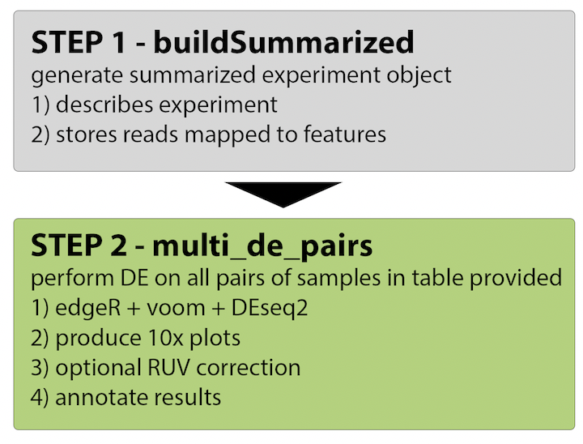

consensusDE inputs
------------------

consensusDE is designed (presently) to either:

1.  count reads from a set of BAM files or;
2.  read in pre-computed counts from HTSEQ.

;given a table and a path that describes the location of the files!

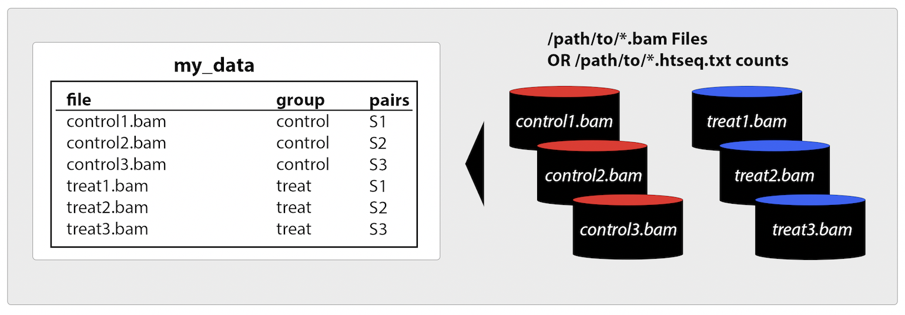

For the workshop today, we will continue with the pre-computed counts for liver versus used during the QFAB R/RNA-seq workshop.

What is a summarized experiment?
================================

A summarized experiment is an object that stores all relevant information for performing differential expression analysis. In simple terms, it's a structured container for storing all your information about an experiment in one place.

-   e.g. count matrix of RNA-seq reads mapped to a feature, additional meta-data.

The following is a schematic of a summarized experiment and how to access stored data (credit: SummarizedExperiment vignette)

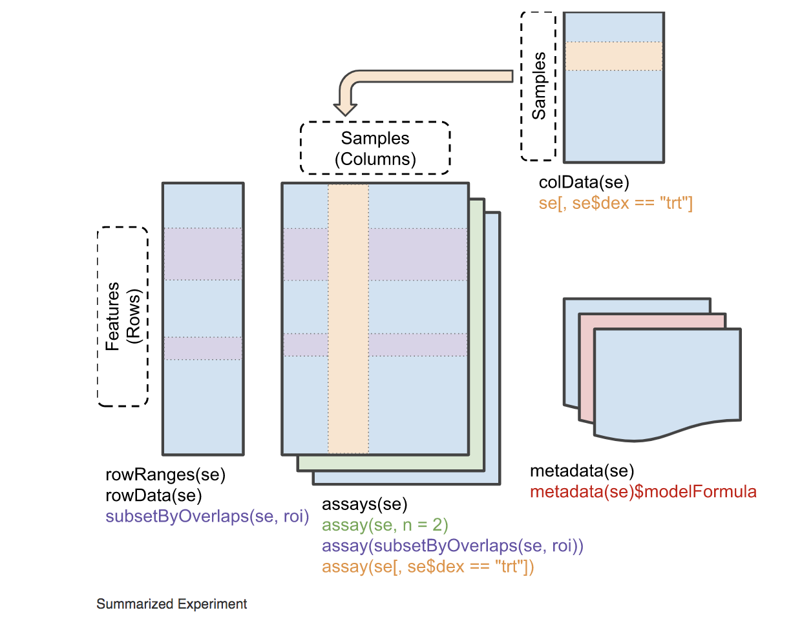

For more information about Summarized Experiment objects, see the following links:

-   [package\_url](https://bioconductor.org/packages/release/bioc/html/SummarizedExperiment.html)
-   [vignette](https://bioconductor.org/packages/release/bioc/vignettes/SummarizedExperiment/inst/doc/SummarizedExperiment.html)

**Note** - this is the minumum requirement for running step 2) `multi_de_pairs`. That is, a summarized experiment, with relevant meta-data is expected.

We will now begin by demonstrating how to build a summarized experiment with the `buildSummarized` function in consensusDE (from the consensusDE vignette), followed by building a custom SummarizedExperiment from the counts data used in the QFAB training.

Building a SummarizedExperiment with consensusDE (a brief demo)
---------------------------------------------------------------

Begin by first installing and loading the `consensusDE` library. To illustrate functionality of `consensusDE`, we will utilise RNA-seq data (in BAM file forma - already mapped to the genome, but not the transcriptome) from the `GenomicAlignments` package.

The `buildSummarized` function in `consensusDE` allows users to build a summarized experiment object by simply providing 1) a table of bam/htseq files (more below on format), 2) the directory of where to locate files and 3) a transcript database to map the reads to (either a gtf file or txdb). Below we will use bam files (from GenomicAlignments) and a txdb as an example for creating a summarized experiment.

``` r
library(consensusDE)
# load dm3 transcript database
# this is used for mapping reads to features (their sequence coordinates) in the database
library(TxDb.Dmelanogaster.UCSC.dm3.ensGene)
```

After loading consensusDE and the txdb, build a sample\_table.

``` r
# build a design table that lists the files and their grouping
file_list <- list.files(system.file("extdata", package="GenomicAlignments"), 
                        recursive = TRUE, 
                        pattern = "*bam$", 
                        full = TRUE)

# Prepare a sample table to be used with buildSummarized()
# must be comprised of a minimum of two columns, named "file" and "group", 
# with two additional columns: "pairs" and "tech_replicate"
# or you will get errors.

sample_table <- data.frame("file" = basename(file_list),
                           "group" = c("treat", "untreat"))

# extract the path to the bam directory - where to search for files listed in "sample_table"
# this will be used in buildSummarized to tell consensusDE where to find the files.
bam_dir <- as.character(gsub(basename(file_list)[1], "", file_list[1]))
```

The minimum information is now ready to build a summarized experiment using consensusDE. This is just for demonstration purposes - consensusDE does not support DE with less than 2 replicates per groups.

``` r
# NB. force_build = TRUE, is set to allow the Summarized Experiment to be built with less than two replicates.
# This will report a Warning message that less than two replicates are present 
# in the sample_table.

summarized_dm3 <- buildSummarized(sample_table = sample_table,
                                  bam_dir = bam_dir,
                                  tx_db = TxDb.Dmelanogaster.UCSC.dm3.ensGene,
                                  read_format = "paired",
                                  force_build = TRUE)
## Warning in buildSummarized(sample_table = sample_table, bam_dir = bam_dir, : No output directory provided. The se file and sample_table will not
##           be saved
## Warning in buildSummarized(sample_table = sample_table, bam_dir = bam_dir, : The sample_table provided contains groups with less than two 
##          replicates. You have selected to continue with force_build = TRUE
```

This will output a summarized object that has mapped the reads from the bam files listed in `sample_table`, located in `bam_dir`, against the transcript database provided: `TxDb.Dmelanogaster.UCSC.dm3.ensGene`. Bam file format, whether "paired" or "single" end (the type of sequencing technology used) must be specified using the `read_format` parameter. gtf formatted transcript databases can also be used instead of a txdb, by providing the full path to the gtf file using the `gtf` parameter. To save a summarized experiment externally, for future use, specify a path to save the summarized experiment using `output_log`. To see details of all parameters see `?buildSummarized`.

Overview of the summarized experiment:

``` r
summarized_dm3
## class: RangedSummarizedExperiment 
## dim: 15682 2 
## metadata(2): gene_coords sample_table
## assays(1): counts
## rownames(15682): FBgn0000003 FBgn0000008 ... FBgn0264726
##   FBgn0264727
## rowData names(0):
## colnames(2): sm_treated1.bam sm_untreated1.bam
## colData names(2): file group
```

Performing Differential Expresssion - following QFAB RNA-seq workshop
=====================================================================

For differential expression (DE) analysis we will use the pre-computed counts matrix and annotation files from the QFAB RNA-seq workshop, comparing gene expression between brain and liver.

We will then assess the variability of genes reported as DE using different RNA-seq algorithms (edgeR, limma/voom, DESeq2).

To achieve this, we will need to: 1) put all data into a SummarizedExperiment (with genomic ranges) 2) reformat comparisons of interest into a sample\_table (meta-data must include the columns "group" and "file" to build the correct models with consensusDE)

For further examples, with and without RUV (removal of unwanted variation), see the \``consensusDE` vignette.

References are available for the papers describing the methods at the end of this document.

DE analysis with QFAB data - following the RNA-seq workshop
-----------------------------------------------------------

First download the files into your local R environment (here using RCurl)

``` r
# read experimental design in (if from a local file)
#expr.design <- read.delim("consensusDE_material/experiment_design.txt")

# using RCurl and downloading from github
library(RCurl)
## Warning: package 'RCurl' was built under R version 3.5.2
## Loading required package: bitops

# download the experimental design (as used in the QFAB example)
expr.design <- getURL("https://raw.githubusercontent.com/awaardenberg/training_material/master/consensusDE_material/experiment_design.txt", ssl.verifyhost=FALSE, ssl.verifypeer=FALSE)
expr.design <- read.delim(textConnection(expr.design), header=T)

# view the data
head(expr.design)
##    SampleID    Source.Name     organism  sex age tissue Extract.Name
## 1 ERR420386 brain_sample_1 Homo sapiens male  26  brain       GCCAAT
## 2 ERR420387 brain_sample_1 Homo sapiens male  26  brain       ACAGTG
## 3 ERR420388 liver_sample_1 Homo sapiens male  30  liver       GTGAAA
## 4 ERR420389 liver_sample_1 Homo sapiens male  30  liver       GTGAAA
## 5 ERR420390 liver_sample_1 Homo sapiens male  30  liver       CTTGTA
## 6 ERR420391 brain_sample_1 Homo sapiens male  26  brain       ACAGTG
##   Material.Type Assay.Name technical.replicate.group
## 1           RNA     Assay4                   group_2
## 2           RNA     Assay2                   group_1
## 3           RNA     Assay7                   group_4
## 4           RNA     Assay8                   group_4
## 5           RNA     Assay6                   group_3
## 6           RNA     Assay1                   group_1

# download the raw counts (as used in the QFAB example)
raw.counts <- getURL("https://raw.githubusercontent.com/awaardenberg/training_material/master/consensusDE_material/raw_read_counts.txt", ssl.verifyhost=FALSE, ssl.verifypeer=FALSE)
raw.counts <- read.delim(textConnection(raw.counts), header=T)

# view the data
head(raw.counts)
##           ERR420386 ERR420387 ERR420388 ERR420389 ERR420390 ERR420391
## 653635           47       151        93       112        19       159
## 100422834         1         0         0         0         0         0
## 645520            1         2         0         0         0         1
## 79501             0         0         0         0         0         0
## 729737           15        35        47        57         5        29
## 100507658        10         5        15         8         8         6
##           ERR420392 ERR420393
## 653635           42        20
## 100422834         1         0
## 645520            3         0
## 79501             0         0
## 729737           15        15
## 100507658        12         4
```

Now clean up the data (technical replicates as per QFAB training). **Note**: consensusDE has an option to merge technical replicates as well, when building a Summarized Experiment if the sample\_table has a column labelled "tech\_replicate".

``` r
# as per QFAB session
pooled.counts <- as.data.frame(t(raw.counts))

# view dimensions
dim(pooled.counts)
## [1]     8 25702

## establish replicate groups
replicate.groups <- split(pooled.counts, expr.design$technical.replicate.group)

# view dimensions for all object
lapply(replicate.groups, dim)
## $group_1
## [1]     2 25702
## 
## $group_2
## [1]     2 25702
## 
## $group_3
## [1]     2 25702
## 
## $group_4
## [1]     2 25702

## column sum for each group
pooled.counts <- sapply(replicate.groups, colSums)

# view dimensions for merged count table (check!)
dim(pooled.counts)
## [1] 25702     4

## filter low counts data
library(edgeR)
## Loading required package: limma
## 
## Attaching package: 'limma'
## The following object is masked from 'package:BiocGenerics':
## 
##     plotMA
# filter settings
isexpr <- rowSums(cpm(pooled.counts)> 1) >= 2

# number to be filtered
table(isexpr)
## isexpr
## FALSE  TRUE 
## 10386 15316

filtered.pooled.counts <- pooled.counts[isexpr,]

# dimensions after filtering
dim(filtered.pooled.counts)
## [1] 15316     4

## establish design matrix
pooled.design <- unique(expr.design[,c('technical.replicate.group',
                                       'Source.Name','sex','age','tissue')])
colnames(pooled.design)[1] <- 'replicate.group'
rownames(pooled.design) <- pooled.design$replicate.group

# the final pooled.design in line with the QFAB workshop
pooled.design
##         replicate.group    Source.Name  sex age tissue
## group_2         group_2 brain_sample_1 male  26  brain
## group_1         group_1 brain_sample_1 male  26  brain
## group_4         group_4 liver_sample_1 male  30  liver
## group_3         group_3 liver_sample_1 male  30  liver
```

Genomic Ranges
--------------

consensusDE requires a "ranged" SummarizedExperiment.

What is "ranged"?

For each feature (here entrezID), we also require the corresponding genomic location (coordinates) of that feature. This is automatically done during `buildSummarized` with consensusDE, but we will be skipping this step, instead building our own custom SummarizedExperiment and directly proceeding to `multi_de_pairs` for DE analysis.

To build a "ranged" SummarizedExperiment, we will:

-   1.  use a database for transcripts from the "hg19" human genome assembly (TxDb.Hsapiens.UCSC.hg19.knownGene) obtained from BioConductor;

-   1.  extract the intersecting genes and their features, for;

-   1.  building a new SummarizedExperiment.

``` r
# load library
library(TxDb.Hsapiens.UCSC.hg19.knownGene)

# assign this to a new variable for simplicity - simple naming ;)
txdb <- TxDb.Hsapiens.UCSC.hg19.knownGene

# view information about the database
TxDb.Hsapiens.UCSC.hg19.knownGene
## TxDb object:
## # Db type: TxDb
## # Supporting package: GenomicFeatures
## # Data source: UCSC
## # Genome: hg19
## # Organism: Homo sapiens
## # Taxonomy ID: 9606
## # UCSC Table: knownGene
## # Resource URL: http://genome.ucsc.edu/
## # Type of Gene ID: Entrez Gene ID
## # Full dataset: yes
## # miRBase build ID: GRCh37
## # transcript_nrow: 82960
## # exon_nrow: 289969
## # cds_nrow: 237533
## # Db created by: GenomicFeatures package from Bioconductor
## # Creation time: 2015-10-07 18:11:28 +0000 (Wed, 07 Oct 2015)
## # GenomicFeatures version at creation time: 1.21.30
## # RSQLite version at creation time: 1.0.0
## # DBSCHEMAVERSION: 1.1

# What are the type of Gene ID?

# first we will assign our pooled reads (generated above) to a new variable
# try with unfiltered...
input_counts <- filtered.pooled.counts

# extract gene ids from the input_counts table
# these are entrez geneIDs
gene_ids <- row.names(input_counts)

# we want to known which entrezID's are also present in the txdb

# obtain genome coordinates (or genomic ranges) from the txdb
# this will retreive the coordinates ordered by gene_id (the entrez ID)
g_ranges <- genes(txdb)

# with the genomic ranges for each feature
g_ranges
## GRanges object with 23056 ranges and 1 metadata column:
##         seqnames              ranges strand |     gene_id
##            <Rle>           <IRanges>  <Rle> | <character>
##       1    chr19   58858172-58874214      - |           1
##      10     chr8   18248755-18258723      + |          10
##     100    chr20   43248163-43280376      - |         100
##    1000    chr18   25530930-25757445      - |        1000
##   10000     chr1 243651535-244006886      - |       10000
##     ...      ...                 ...    ... .         ...
##    9991     chr9 114979995-115095944      - |        9991
##    9992    chr21   35736323-35743440      + |        9992
##    9993    chr22   19023795-19109967      - |        9993
##    9994     chr6   90539619-90584155      + |        9994
##    9997    chr22   50961997-50964905      - |        9997
##   -------
##   seqinfo: 93 sequences (1 circular) from hg19 genome

# obtain the common set of gene IDs present in the txdb are also present in the counts file
# Note: g_ranges$gene_id accesses the "gene_id" column
intersect_geneids <- intersect(g_ranges$gene_id, gene_ids)

# what is the length of the common set of genes?
length(intersect_geneids)
## [1] 14475

# now subset the genome ranges (coordinates)
# this is looking for all g_ranges with a gene_id that is also present in the intersect
g_ranges <- g_ranges[g_ranges$gene_id %in% intersect_geneids,]

# check that the length is the same as the intersect
length(g_ranges)
## [1] 14475

# and only keep the count files with an equivalent genomic ranges
counts <- input_counts[row.names(input_counts) %in% intersect_geneids,]

# check that the length is the same as the intersect
nrow(counts)
## [1] 14475

# Or ask the question? Do they match?
nrow(counts) == length(g_ranges)
## [1] TRUE

# data cleaned :)
```

Build a summarizedExperiment
----------------------------

We have now cleaned up the genomic ranges to match the genes present in the count file. Next we will build a SummarizedExperiment from this data.

### Generate a sample\_table describing the experiment

First - we will generate a new sample\_table, which is a data.frame describing samples.

In paired mode it must at least 2 columns, "file", "group".

Optional additional columns include, "pairs" and "tech\_replicate" for describing sample pairing and instances of technical replicates. The filename "file" must correspond to the name of the file.

``` r
# design of experiment
sample_table <- data.frame("file" = pooled.design$replicate.group, 
                           "group" = pooled.design$tissue)

# "file" must match column names or you will get an error

# view the sample_table
sample_table
##      file group
## 1 group_2 brain
## 2 group_1 brain
## 3 group_4 liver
## 4 group_3 liver
```

Now we will build the SummarizedExperiment.

``` r
library(SummarizedExperiment)
## Loading required package: DelayedArray
## Loading required package: matrixStats
## 
## Attaching package: 'matrixStats'
## The following objects are masked from 'package:Biobase':
## 
##     anyMissing, rowMedians
## Loading required package: BiocParallel
## Warning: package 'BiocParallel' was built under R version 3.5.2
## 
## Attaching package: 'DelayedArray'
## The following objects are masked from 'package:matrixStats':
## 
##     colMaxs, colMins, colRanges, rowMaxs, rowMins, rowRanges
## The following objects are masked from 'package:base':
## 
##     aperm, apply

# create a new SummarizedExperiment (se) and store the counts in this object
se <- SummarizedExperiment(assays=SimpleList(counts=as.matrix(counts)))

# view the se
se
## class: SummarizedExperiment 
## dim: 14475 4 
## metadata(0):
## assays(1): counts
## rownames(14475): 653635 729737 ... 246119 9086
## rowData names(0):
## colnames(4): group_1 group_2 group_3 group_4
## colData names(0):

# udpate meta-data (details of experiment) for summarizedExperiment
# this is required for multi_de_pairs
colData(se) <- DataFrame(sample_table)
colnames(se) <- sample_table$file 
rowRanges(se) <- g_ranges
rownames(se) <- row.names(counts)

# view the updated summarizedexperiment
se
## class: RangedSummarizedExperiment 
## dim: 14475 4 
## metadata(0):
## assays(1): counts
## rownames(14475): 653635 729737 ... 246119 9086
## rowData names(1): gene_id
## colnames(4): group_2 group_1 group_4 group_3
## colData names(2): file group

# and for accessing the counts?
head(assays(se)$counts)
##           group_2 group_1 group_4 group_3
## 653635        310      89      39     205
## 729737         64      30      20     104
## 100288069      56      64      56      67
## 643837        151     198     181     222
## 26155         197      89      49     265
## 9636          195       3       7     330
```

Performing differential expression
----------------------------------

To perform DE we will use the multi\_de\_pairs function of consensusDE. For more information call using ?multi\_de\_pairs, and *pay attention to defaults*

`multi_de_pairs` will perform DE analysis on all possible pairs of "groups" and save these results as a simple list of "merged" results - being the results of "deseq", "voom" and "edger" merged into one table, as well as the latter three as objects independently.

``` r
# pay attention to defaults
all_pairs <- multi_de_pairs(summarized = se,
                            adjust_method = "bonferroni", #for consistency
                            verbose = TRUE)
```

Accessing the results?

``` r
# 1) main table - this is the table we are primarily interested in
merged <- all_pairs$merged[["liver-brain"]]

# view the table 
head(merged)
##     ID  AveExpr     LogFC  LogFC_sd  edger_adj_p   deseq_adj_p voom_adj_p
## 1 3240 13.23676 10.119327 0.5382095 2.267105e-67 7.132539e-257 0.01596555
## 2 2243 12.88677 10.404784 0.5473900 1.279518e-65 1.756881e-201 0.03372451
## 3  229 11.92061  9.901384 0.5444508 1.295815e-67 3.857982e-191 0.04257529
## 4 5265 12.65063  9.459089 0.5394374 6.705970e-64 7.141550e-215 0.02034383
## 5 2638 11.50339 10.588836 0.5445559 5.130736e-68 3.196421e-170 0.08213910
## 6 2244 12.68825 10.483821 0.5485756 3.599986e-64 1.111993e-193 0.04552086
##   edger_rank deseq_rank voom_rank rank_sum p_intersect       p_union
## 1          7          1         1        9  0.01596555 7.132539e-257
## 2         12          4         3       19  0.03372451 1.756881e-201
## 3          5          8         6       19  0.04257529 3.857982e-191
## 4         21          2         2       25  0.02034383 7.141550e-215
## 5          4         11        14       29  0.08213910 3.196421e-170
## 6         18          7         8       33  0.04552086 1.111993e-193
```

The merged data frame is sorted by `rank_sum`. The following columns are reported by default:

-   `ID` - Identifier
-   `AveExpr` - Average Expression (average of edgeR, DESeq2 and voom)
-   `LogFC` - Log2 Fold-Change, also known as a log-ratio (average of edgeR, DESeq2 and voom)
-   `LogFC_sd` - Log2 Fold-Change standard deviation of LogFC (average)
-   `edger_adj_p` - EdgeR p-value adjusted for multiple hypotheses
-   `deseq_adj_p` - DESeq2 p-value adjusted for multiple hypotheses
-   `voom_adj_p` - Limma/voom p-value adjusted for multiple hypotheses
-   `edger_rank` - rank of the p-value obtained by EdgeR
-   `deseq_rank` - rank of the p-value obtained by DESeq2
-   `voom_rank` - rank of the p-value obtained by Limma/voom
-   `rank_sum` - sum of the ranks from edger\_rank, voom\_rank, rank\_sum
-   `p_intersect` - the largest p-value observed from all methods tested.
    -   This represents the intersect when a threshold is set on the p\_intersect column
-   `p_union` - the smallest p-value observed from all methods tested.
    -   This represents the union when a threshold is set on the p\_union column

### Advanced - accessing all results

``` r
# 2) results from each method and results
# here just showing the voom
# 2.1) short/tidy results
head(all_pairs$voom$short_results)

# 2.2) full results as reported by deseq
head(all_pairs$voom$full_results)

# 2.3) all details of fit (model applied)
all_pairs$voom$fitted

# 2.4) the contrasts used/comparisons included in the model
all_pairs$voom$contrasts
```

When performing DE analysis with consensusDE, data is stored in a simple list object. Below are the levels of data available from the output of a DE analysis. We use the `all_pairs` results from the above analysis to demonstrate how to locate these tables.

-   `all_pairs$merged`
    -   list of the comparisons performed

In addition to the list with the combined results of DESeq2, Voom and EdgeR, the full results can be accessed for each method, as well as fit tables and the contrasts performed.

-   `all_pairs$deseq` (list of the DEseq2 results)
-   `all_pairs$voom` (list of the Voom results)
-   `all_pairs$edger` (list of the edgeR results)

Within each list the following data is accessible. Each object is list of all the comparisons performed.

Below, is how to access the voom results (as shown above).

-   `all_pairs$voom$short_results`
    -   Formatted results. To access the first table, for examples, use `all_pairs$voom$short_results[[1]]`
-   `all_pairs$voom$full_results`
    -   Full results that normally ouput by a pairwise comparison
-   `all_pairs$voom$fitted`
    -   Fit table to access coeffients etc.
-   `all_pairs$voom$contrasts`
    -   Contrasts performed

Challenge: writing tables to a output directory
===============================================

Try specifying directories of where to place files.

`multi_de_pairs` provides options to automatically write all results to output directories when a full path is provided. Which results are output depends on which directories are provided. Full paths provided to the parameters of `output_voom`, `output_edger`, `output_deseq` and `output_combined` will output Voom, EdgeR, DEseq and the merged results to the directories provided, respectively.

After running multi\_de\_pairs, with the directories, inspect the plots.

### Advanced - Normalisation options

consensusDE currently implements two main normalisation approaches in `multi_de_pairs()`. These are specified with the `norm_method` parameter, where options are: `EDASeq` or `all_defaults`. As per the parameter description, when `all_defaults` is selected, this will use default normalisation methods for DE, EDASeq for QC (with control via `EDASeq_method`), and edgeR "upperquantile" for determining RUV residuals (as per RUVSeq vignette). However, when `EDASeq` is selected, this will use EDASeq normalisation and the specified `EDASeq_method` throughout, for RUV, edgeR, DESeq2 and voom/limma. Using the `EDASeq` allows for a standard normalisation approach to be used throughout, whereas `all_defaults`, allows for variation of normalisation approach to also be modelled into the final merged results table.

Plotting functions
==================

When performing DE analysis, a series of plots (currently 10) can be generated and saved as .pdf files in a plot directory provided to `multi_de_pairs()` with the parameter: `plot_dir = "/path/to/save/pdfs/`. See `?multi_de_pairs` for description.

In addition, each of the 10 plots can be plotted individually using the `diag_plots` function. See `?diag_plots` for description, which provides wrappers for 10 different plots. Next we will plot each of these using the example data.

General notes about plotting
----------------------------

The legend and labels can be turned off using `legend = FALSE` and `label = TRUE` for `diag_plots()`. See `?diag_plots` for more details of these parameters.

plotting examples
-----------------

This is performed on the raw count data. We will not revisit how to obtain QC plots. This was covered in the QFAB training.

``` r
# Principle Component Analysis
diag_plots(se_in = se,
           name = "QFAB example data",
           pca = TRUE)
```

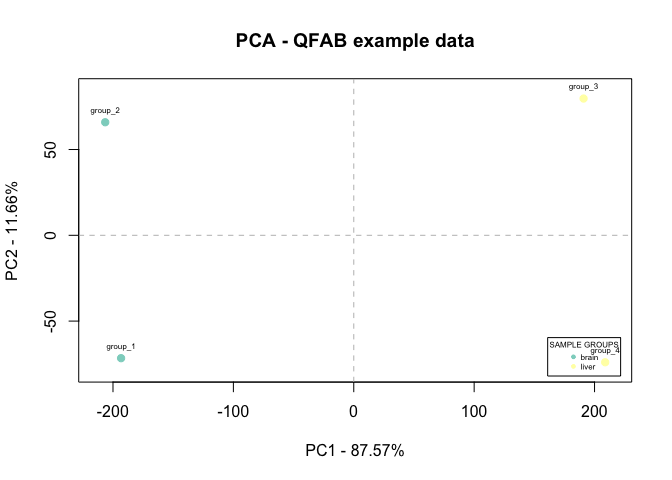

``` r

# + hierarchical clustering etc.
# + etc.

# try ?diag_plots to see options (see end of workshop for examples)
```

MA Plot
-------

This will perform an MA plot given a dataset of the appropriate structure. This will plot the Log-fold change (M) versus the average expression level (A). To use independently of `multi_de_pairs()` and plot to only one comparison, constructing a list with one data.frame with the columns labelled "ID", "AveExpr", and "Adj\_PVal" is required. The following illustrates an example for using the merged data, which needs to be put into a list and labelled appropriately. Note that this is done automatically with `multi_de_pairs()`.

``` r
# 1. View all the comparisons conducted
names(all_pairs$merged)
## [1] "liver-brain"
# 2. Extract the data.frame of interest of a particular comparison
comparison <- all_pairs$merged[["liver-brain"]]
```

``` r
# this will not work unless in a list and will stop, producing an error. E.g.
diag_plots(merged_in = comparison,
           name = "liver-brain",
           ma = TRUE)

# Error message:
merged_in is not a list. If you want to plot with one comparison only,
put the single dataframe into a list as follows. my_list <- list("name"=
merged_in)
```

``` r
# 3. Put into a new list as instructed by the error
comparison_list <- list("liver-brain" = comparison)

# this will not work unless the appropriate columns are labelled
# "ID", "AveExpr", and "Adj_PVal"

# 4. Relabel the columns for plotting
# inspecting the column names reveals that the "Adj_PVal" column needs to be specified.
colnames(comparison_list[["liver-brain"]])
##  [1] "ID"          "AveExpr"     "LogFC"       "LogFC_sd"    "edger_adj_p"
##  [6] "deseq_adj_p" "voom_adj_p"  "edger_rank"  "deseq_rank"  "voom_rank"  
## [11] "rank_sum"    "p_intersect" "p_union"

# Here, we will relabel "p_intersect" with "Adj_PVal" to use this p-value, using
# the "gsub" command as follows.

# remember - p-intersect in the intersecting p-value (or the best p-value observed)

colnames(comparison_list[["liver-brain"]]) <- gsub("p_intersect", "Adj_PVal",
                                                 colnames(comparison_list[["liver-brain"]]))

# after label
colnames(comparison_list[["liver-brain"]])
##  [1] "ID"          "AveExpr"     "LogFC"       "LogFC_sd"    "edger_adj_p"
##  [6] "deseq_adj_p" "voom_adj_p"  "edger_rank"  "deseq_rank"  "voom_rank"  
## [11] "rank_sum"    "Adj_PVal"    "p_union"
```

``` r
# 5. Plot MA
diag_plots(merged_in = comparison_list,
           name = "liver-brain",
           ma = TRUE)
```

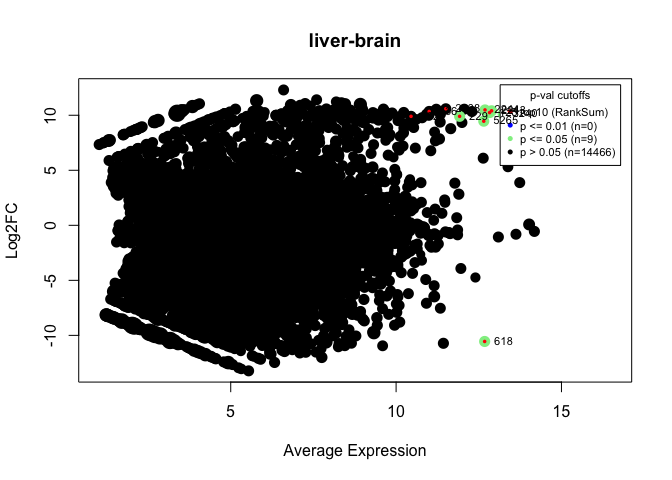

Volcano
-------

This plot a volcano plot, which compares the Log-fold change versus significance of change -log transformed score. As above and described in the MA plot section, to use independently of `multi_de_pairs()` and plot to only one comparison, constructing a list with one data.frame with the columns labelled "ID", "AveExpr", and "Adj\_PVal" is required.

``` r
diag_plots(merged_in = comparison_list,
           name = "liver-brain",
           volcano = TRUE)
```

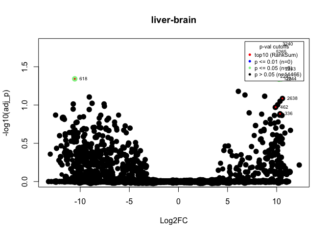

Challenge: generate volcano plot using the voom results only
============================================================

Hint - you will need to access the voom results first.

FYI - annotating DE results
===========================

Will not do this today - but an example is available in the consensusDE vignette.

Additional annotation of transcripts can be performed by providing a database for annotations via `ensembl_annotate`. Annotations needs to be a Genome Wide Annotation object, e.g. `org.Mm.eg.db` for mouse or `org.Hs.eg.db` for human from BioConductor.

It is *recommended* to annotate with a GTF file by providing the full path of a gtf file to the gtf\_annotate parameter of multi\_de\_pairs, in combination with a tx\_db. Currently only ENSEMBL annotations are supported with the tx\_db option.

An example of annotating the above filtered airway data is provided below.

When annotation is performed, the following additional columns will be present:

-   `genename` - extend gene names (e.g. alpha-L-fucosidase 2)
-   `symbol` - gene symbol (e.g. FUCA2)
-   `kegg` - kegg pathway identifier (e.g. 00511)

If metadata for a transcript database used to build the summarized experiment was also included, the following annotations will also be included:

-   `coords` - chromosomal coordinates (e.g. chr6:143494811-143511690)
-   `strand` - strand transcript is on (i.e. + or -)
-   `width` - transcript width in base pairs (bp) (transcript start to end) (e.g. 16880 bp)

Summary
=======

Here we have...

-   Formatted *raw.counts.txt* into a RangedSummarizedExperiment for analysis with consensusDE
-   Obtained results using 3 different RNA-seq algorithms: limma/voom, DESeq2 and edgeR

We have not...

-   used the RUV algorithm implemented in consensusDE, for removal of unwanted variation
-   covered QC (covered QFAB training)

**Thank you :) Questions, comments, suggestions?**

-   email: <a.waardenberg@gmail.com>

Appendix
========

Installation cheat-sheets
-------------------------

### Install Development Version of consensusDE

Installation instruction here: <https://www.bioconductor.org/packages/devel/bioc/html/consensusDE.html>

``` r
if (!requireNamespace("BiocManager", quietly = TRUE))
    install.packages("BiocManager")

# The following initializes usage of Bioc devel
BiocManager::install(version='devel')
BiocManager::install("consensusDE")
```

If this is problematic, due to your R version. You can install consensusDE from github as follows.

### Install github Version of consensusDE

1.  install devtools and RCurl from cran

``` r
install.packages("devtools")
install.packages("RCurl")
```

1.  install consensusDE from github Instructions as per git landing page: <https://github.com/awaardenberg/consensusDE>

``` r
# make sure devtools is installed first
library(devtools)
devtools::install_github("awaardenberg/consensusDE", build_vignettes = TRUE)
```

1.  additional packages to install

``` r
#TxDb.Hsapiens.UCSC.hg19.knownGene

if (!requireNamespace("BiocManager", quietly = TRUE))
    install.packages("BiocManager")
BiocManager::install("TxDb.Hsapiens.UCSC.hg19.knownGene")
```

References
==========

When using this package, please cite consensusDE as follows and all methods used in your analysis.

For consensus DE:

``` r
citation("consensusDE")
## 
## To cite package 'consensusDE' in publications use:
## 
##   Ashley J. Waardenberg (2019). consensusDE: RNA-seq analysis
##   using multiple algorithms. R package version 1.3.3.
## 
## A BibTeX entry for LaTeX users is
## 
##   @Manual{,
##     title = {consensusDE: RNA-seq analysis using multiple algorithms},
##     author = {Ashley J. Waardenberg},
##     year = {2019},
##     note = {R package version 1.3.3},
##   }
## 
## ATTENTION: This citation information has been auto-generated from
## the package DESCRIPTION file and may need manual editing, see
## 'help("citation")'.
```

-   consensusDE pre-print (also check package reference suggestions)
    -   Waardenberg, AJ. and Field MA (2019). consensusDE: an R package for assessing consensus of multiple RNA-seq algorithms with RUV correction. bioRxiv. <doi:10.1101/692582>
-   When using RUVseq (also check package reference suggestions)
    -   D. Risso, J. Ngai, T. P. Speed and S. Dudoit (2014). Normalization of RNA-seq data using factor analysis of control genes or samples Nature Biotechnology, 32(9), 896-902
-   When using DESeq2 (also check package reference suggestions)
    -   Love, M.I., Huber, W., Anders, S. Moderated estimation of fold change and dispersion for RNA-seq data with DESeq2 Genome Biology 15(12):550 (2014)
-   When using edgeR (also check package reference suggestions)
    -   Robinson MD, McCarthy DJ and Smyth GK (2010). edgeR: a Bioconductor package for differential expression analysis of digital gene expression data. Bioinformatics 26, 139-140
    -   McCarthy DJ, Chen Y and Smyth GK (2012). Differential expression analysis of multifactor RNA-Seq experiments with respect to biological variation. Nucleic Acids Research 40, 4288-4297
-   When using limma/voom (also check package reference suggestions)
    -   Ritchie, M.E., Phipson, B., Wu, D., Hu, Y., Law, C.W., Shi, W., and Smyth, G.K. (2015). limma powers differential expression analyses for RNA-sequencing and microarray studies. Nucleic Acids Research 43(7), e47.

Plotting functions appendix
===========================

When performing DE analysis, a series of plots (currently 10) can be generated and saved as .pdf files in a plot directory provided to `multi_de_pairs()` with the parameter: `plot_dir = "/path/to/save/pdfs/`. See `?multi_de_pairs` for description.

In addition, each of the 10 plots can be plotted individually using the `diag_plots` function. See `?diag_plots` for description, which provides wrappers for 10 different plots. Next we will plot each of these using the example data.

Mapped reads
------------

Plot the number of reads that mapped to the transcriptome of each sample. The sample numbers on the x-axis correspond to the sample row number in the summarizedExperiment built, accessible using `colData(airway)`. Samples are coloured by their "group".

``` r
diag_plots(se_in = se,
           name = "QFAB example data",
           mapped_reads = TRUE)
```

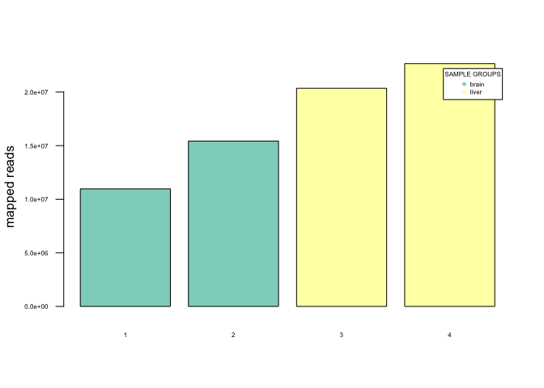

Relative Log Expression
-----------------------

``` r
diag_plots(se_in = se,
           name = "QFAB example data",
           rle = TRUE)
```

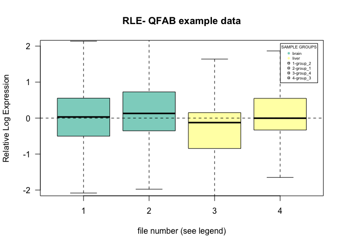

Principle Component Analysis
----------------------------

``` r
diag_plots(se_in = se,
           name = "QFAB example data",
           pca = TRUE)
```


RUV residuals
-------------

Residuals for the RUV model can be plotted as follows:

``` r
diag_plots(se_in = all_pairs$summarized,
           name = " example data",
           residuals = TRUE)
```

Hierarchical Clustering
-----------------------

``` r
diag_plots(se_in = se,
           name = "QFAB example data",
           hclust = TRUE)
```

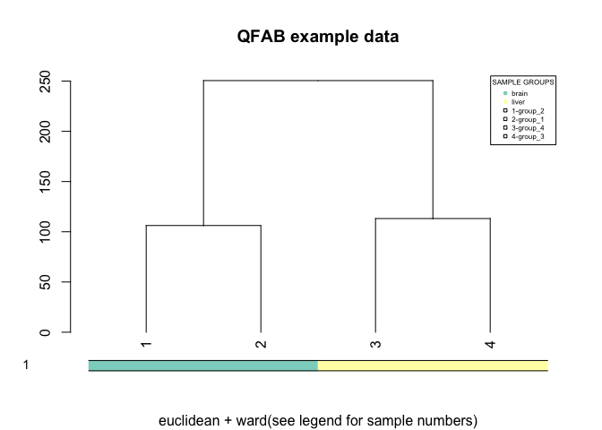

Density distribution
--------------------

``` r
diag_plots(se_in = se,
           name = "QFAB example data",
           density = TRUE)
```

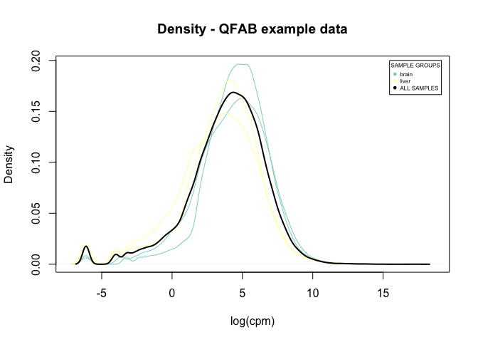

Boxplot
-------

``` r
diag_plots(se_in = se,
           name = "QFAB example data",
           boxplot = TRUE)
```

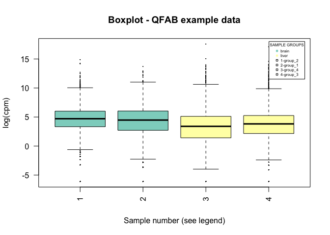

Waardenberg, AJ, and MA Field. 2019. “consensusDE, an R Package for Assessing Consensus of Multiple RNA-Seq Algorithms with RUV Correction.” *XX* XX (preprint). XX: XX–XX. doi:[https://doi.org/10.1101/692582](https://doi.org/https://doi.org/10.1101/692582).
